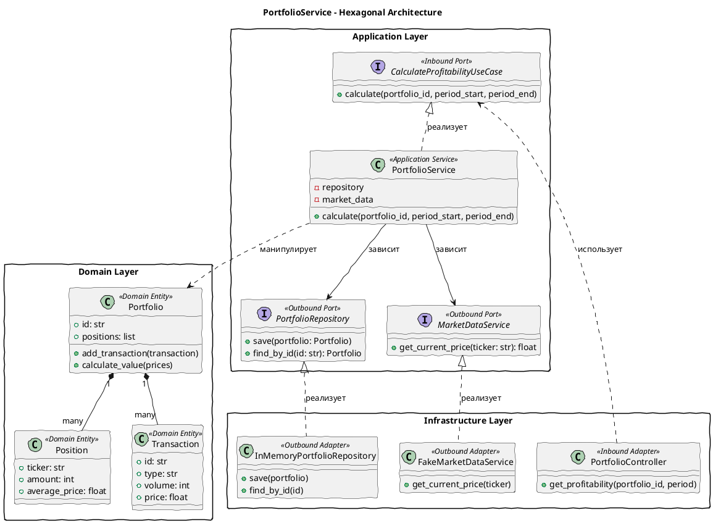

# Архитектура центрального сервиса: PortfolioService

## Диаграмма архитектуры (гексагональная)

## Объяснение портов

**Входящие порты (Inbound Ports):**
- `CalculateProfitabilityUseCase`: Служит точкой входа для операций расчета доходности (например, из контроллера REST или gRPC). Определяет метод, принимающий ID портфеля и временной период, и возвращающий финансовый отчет.

**Исходящие порты (Outbound Ports):**
- `PortfolioRepository`: Выступает интерфейсом хранилища (базы данных) портфелей. Его реализуют конкретные адаптеры (например, `InMemoryPortfolioRepository`).
- `MarketDataService`: Интерфейс для взаимодействия со сторонним сервисом (API) рыночных цен. Он позволяет приложению запрашивать котировки без привязки к конкретному HTTP-клиенту.

## Принципы SOLID

- **Dependency Inversion Principle (DIP)**: `PortfolioService` зависит от абстракций `PortfolioRepository` и `MarketDataService`, а не от их реализаций. Сама реализация внедряется через DI.
- **Single Responsibility Principle (SRP)**: Доменный слой (сущности) отвечают только за представление данных и внутренние расчеты; Application-слой оркестрирует процесс получения данных; Infrastructure-слой отвечает за ввод/вывод и REST/БД.
